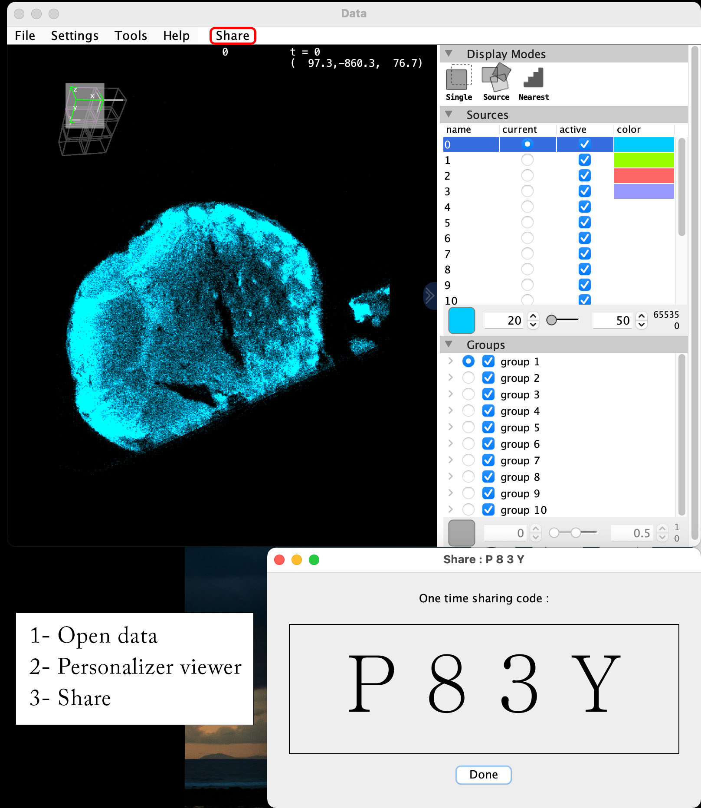
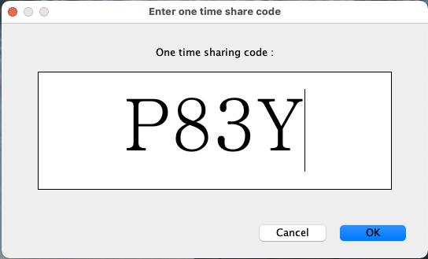
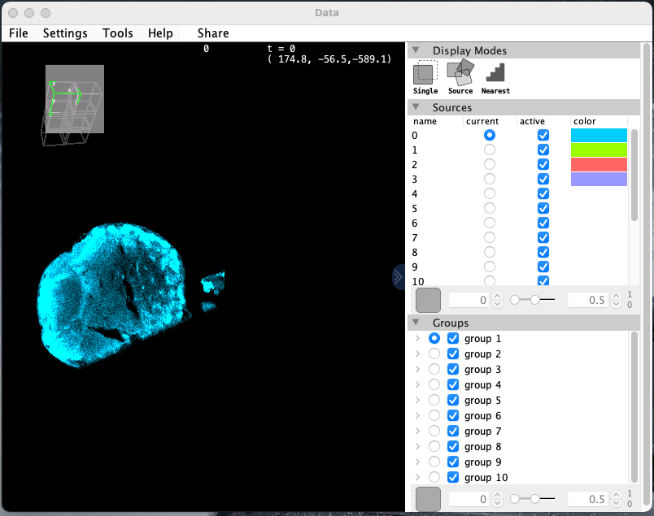

# BigDataViewer Shareable 

You can get your data, with the same visualization parameters opened in another computer. only, by a simple smart code  _( Expl : XLMH )_

### How to use:

You open your data using
#### 1- BDVShareable
The data should be remote in AWS: 
- ##### Spimdata `openSpim(AWSSpimSupplier supplier)`
- #####  N5 data `openN5(AWSN5Supplier supplier)`

Play with your data to get the best view then share

by clicking share you get a popup with 4 Character code.
This code need to shared to your collaborator.

----
#### 2- OpenBdvUsingID
In the second computer you need to open `OpenBdvUsingID`
Then input the code in this view:

By inputing the code you will get an instance of BigDataViewer with the same data, view, transformation, brightness and color.

### Include:
Include to your project using Jitpack.io

1- Add repository

        <repository>
            <id>jitpack.io</id>
            <url>https://jitpack.io</url>
        </repository>

2- Add dependency to your project

        <dependency>
            <groupId>com.github.BigDistributor</groupId>
            <artifactId>BDVShareable</artifactId>
            <version>[COMMIT_NUMBER]</version>
        </dependency>

### Made with: 
- a Quarkus RESTFull server created by us for this task https://github.com/BigDistributor/bv_server
- BigDataViewer
- Gson
- Javax
- Imglib2
- N5
- Spimdata